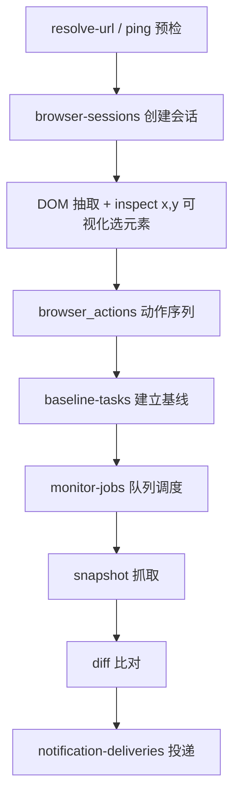

# 页面变化检测设计（对标 PageWatch）

本文是对 [pagewatch.tech](https://www.pagewatch.tech/#how-it-works) 的逆向分析结论，以及落到本项目的改造建议。
相关文档：[ui-regression-workflow.md](./ui-regression-workflow.md)、[style-drift-workflow.md](./style-drift-workflow.md)、[test-jobs.md](./test-jobs.md)。

## 一、结论先行

PageWatch 的核心不是「定时抓 HTML + 文本 diff」，而是**有状态的远端浏览器会话 + 元素级指纹基线**。它值得借鉴的只有四件事：

1. **元素指纹（多路定位）** —— 一个监控目标存 7 个定位维度，而不是一个 CSS selector。这是本项目最该补的短板。
2. **分区快照** —— 快照按区域结构化存储，而不是整页文本拼一个字符串。
3. **乐观锁 revision** —— 所有写操作带 `expected_revision`，解决「用户改配置」与「后台跑基线」撞车。
4. **job 表与 delivery 表分离** —— 调度、执行、通知投递三段解耦，各自可独立重试。

反过来，本项目**已经明显优于 PageWatch** 的部分，不要重复建设：

| 能力 | 本项目 | PageWatch |
|------|--------|-----------|
| 像素对比 | `pixelmatch` + 区域聚合分级（`diffRegions` high/low） | 有 diff，但前端 schema 不稳定 |
| 遮罩 | `maskSelectors` 支持按 script 维度配置 + `ignoreRegions` | 只有整体 `ignore` |
| 样式漂移 | `styleChecks` 对比 computed style（fontSize/color/borderRadius/boxShadow） | 无 |
| 门禁分层 | `gate.mode: style-only` + `pixelScriptPrefixes` + blocker/warning 双阈值 | 无分层 |
| 基线质量守卫 | `baseline-quality.ts` 拒收登录页/空壳/尺寸不一致 | 无 |
| 步骤自愈 | `heal-step.ts` + `failure-bundle.ts` | 只有手动单步回放 |
| 动画冻结 | `freezeAnimations: true` | 未见 |

## 二、PageWatch 架构还原

### 2.1 技术栈

前端 Next.js App Router（路由组 `(market)` / `(auth)` / `(dashboard)`）+ Tailwind v4 + Base UI + lucide + VChart + dnd-kit，Cloudflare 前置。
后端 Python/FastAPI（405 响应头 `allow: GET`，前端兼容 `detail` / `detail.message` 两种错误体），同域 `/api` 反代，无独立 api 子域。
统一信封 `{ code, message, data }`，`code: 0` 表示成功。

认证走 Cookie 会话而非 Bearer：`credentials: "include"`，401 时自动打一次 `/auth/refresh` 再重放原请求，并刻意把 login/register/refresh/password-reset 排除在重试之外以防递归。客户端对并发 GET 做 in-flight Promise 去重。

### 2.2 抓取链路



`fetch_engine` 字段硬编码为 `"BROWSER"`，但结构保留了将来切纯 HTTP 抓取的余地。

动作 DSL 共 11 种：`click` / `type` / `select` / `block` / `wait` / `iframe` / `cookie` / `refresh` / `scroll` / `goto` / `script`（可注入任意 JS）。
会话侧提供 `actions/execute`、`actions/replay?through_step=N`、`actions/test` 三个接口，支持**回放到第 N 步**做单步调试。这一点和本项目 `flow-replay.ts` 的定位重合，本项目已有等价能力。

### 2.3 元素指纹（核心亮点）

PageWatch 不存单个 selector，每个监控元素存的是一组冗余定位信息：

```json
{
  "tag": "div",
  "stable_attributes": { "data-testid": "price", "role": "cell" },
  "text_hint": "￥1,299",
  "xpath": "/html/body/div[2]/main/section[1]/div[3]",
  "id_selector": "#product-price",
  "css_selector": "main > section:nth-child(1) > div.price",
  "selector_display": "价格区块",
  "baseline_rect": { "x": 120, "y": 340, "width": 200, "height": 48 },
  "baseline_page_width": 1280,
  "baseline_page_height": 3200
}
```

定位时主用 `xpath=`，`id_selector` 进 `fallback_selectors` 兜底，`baseline_rect` 配合 `baseline_page_*` 做坐标归一化（页面宽度变了也能按比例还原区域）。
`comparison_strategy` 默认 `"ROLLING"`（滚动基线，与上次快照比），`selection.mode` 有 `ELEMENT`（元素）和 `RECTANGLE_VISUAL`（自由框选区域）两种。

### 2.4 配额与频率

| 档位 | 页面数 | 最小间隔 | 月检查次数 | 历史保留 | 价格 |
|------|--------|----------|------------|----------|------|
| free | 6 | 6h | 300 | 30 天 | $0 |
| starter | 50 | 15m | 3000 | 90 天 | $4.99 |
| plus | 150 | 5m | 10000 | 365 天 | $12.99 |
| pro | 300 | 2m | 25000 | 无限 | $29.99 |

频率档位是枚举而非自由输入：`every_2m` / `every_5m` / `every_15m` / `every_30m` / `hourly` / `every_3h` / `every_6h` / `every_12h` / `daily`。

### 2.5 它做得不好的地方（别抄）

**URL 归一化不拦私有网段。** 前端对 `localhost` / `127.x` / `10.x` / `192.168.x` / `172.16-31.x` 只改协议不阻断，若后端无白名单即为 SSRF。自建时务必在**后端**做出网校验。

**diff schema 不稳定。** 前端归一化层对同一语义字段试了大量别名：`change` / `action` / `change_type` / `status` / `type`，以及 `before` / `old` / `old_text` / `previous` / `removed` / `from`，还要在缺失时反推 `changeType`。这是后端契约没定死留下的技术债，本项目应当先把 diff 结果类型定义写成单一 TS type 再实现。

**管理后台仅靠路径混淆。** 后台挂在 `/dashboard/p0rtal`，暴露 `monitor-jobs`、`notification-deliveries`、`monitor-stats/hourly`、`proxy-pool`、`audit-logs`、博客 CMS。路径混淆不是鉴权。

## 三、本项目的真实缺口

以下三条是读代码后确认的问题，不是猜测。

### 缺口 1：domHash 是「截断前缀」而不是哈希

项目里有两套 domHash 实现，都不具备判别力。

Playwright 侧在 `src/utils/screenshot-capture.ts` 的 `domFingerprintFn`：

```js
// 当前实现：tag + 直接子元素数 + className 前 120 字
return tag + '|' + children + '|' + cls;
```

作用在 `domHashRoot: 'body'` 上，产出形如 `BODY|1|app-root`。**body 内部任何改动都不会改变这个值**，除了 body 直接子节点数量变化。

ego 侧在 `src/runtime/execute-intent-ego.ts` 的 `egoDomHash`：

```ts
nodes.slice(0, 48).map(n => `${n.role}:${n.name}`).join('|')
// 再 base64，再 .slice(0, 32)
```

产出 `EGO|79|dGFibGlzdDrlt6XkvZzlj7Ag5raI6LS5`。只取**前 48 个节点**，再把 base64 **截断到 32 字符**，实际只覆盖了页面开头约 24 字节的原文。页面中后段（表格主体、详情区）改动完全检测不到。

`baseline-quality.ts` 里的 `isEmptyShellDomHash` 已经在防「空壳」，但它防的是「哈希太短说明页面没渲染」，治的是症状；根因是哈希本身没覆盖全页。

### 缺口 2：pageText 是整页文本无脑拼接

`execute-intent-ego.ts:278`：

```ts
pageText: extractVisibleTexts(snapshot).join(' ').slice(0, 800)
```

实际落盘的 meta 里混着 `99+`（徽标计数）、`CD2085297215794155522`（单号）、`2026-08-06`（日期）这类每次运行都变的数据。它现在只被 `baseline-quality.ts` 用于登录页文案检测，还算安全；但一旦想用它做文本变化检测，噪声会直接淹没信号。

### 缺口 3：StructureCheckItem 只有单个 selector，且全项目无并发锁

`scripts/report/ui-regression-config.ts` 的类型定义：

```ts
export interface StructureCheckItem {
  key: string;
  selector: string;      // 只有一个，选择器一漂移就 missing-selector
  script?: string;
  required?: boolean;
  frame?: 'main' | 'first';
  snapshotName?: string;
  state?: string;
}
```

没有 xpath、没有 fallback、没有 text hint。前端一次重构 class 名，`required: true` 的项直接判 blocker 误报。

并发方面，`grep -rniE "lockfile|flock|revision|mutex" src scripts` **零命中**。但 `test-job` + `node-cron` daemon 会并发跑任务，`promote-baseline` 直接写 `screenshots-baseline/`，多任务同时晋升同一 script 时会互相覆盖。

## 四、改造方案

### 4.1 domHash 改为分区语义哈希（优先级最高）

把「一个整页 domHash」换成「一组分区哈希」，用真哈希而非截断。

```ts
// 建议放 src/utils/dom-fingerprint.ts
export interface SectionFingerprint {
  /** 分区标识，如 header / sidebar / main-table / footer */
  key: string;
  /** 结构哈希：标签树 + 稳定属性，不含文本 */
  structureHash: string;
  /** 文本哈希：归一化后的可见文本 */
  textHash: string;
  /** 节点计数，用于给出「变多/变少」的方向 */
  nodeCount: number;
  /** 直接子元素 tag 序列，用于定位是哪一段变了 */
  childTags: string;
}
```

浏览器侧采集函数要点：

```js
function fingerprintSection(root) {
  const parts = [];
  const walk = (el, depth) => {
    if (depth > 12) return;
    if (el.hasAttribute('data-pw-mask')) return;         // 复用现有 mask 标记
    const stable = ['data-testid', 'role', 'aria-label', 'name', 'type']
      .map(a => el.getAttribute(a)).filter(Boolean).join(',');
    parts.push(el.tagName + (stable ? '[' + stable + ']' : ''));
    for (const c of el.children) walk(c, depth + 1);
  };
  walk(root, 0);
  return parts.join('>');                                 // 交给 Node 侧算 sha256
}
```

关键约束：

- **结构哈希不含文本**，文本单独算 `textHash`。这样能区分「布局变了」和「只是内容更新了」，直接对应两种不同严重度。
- 哈希用 `crypto.createHash('sha256').digest('hex').slice(0, 16)`，**不要截断原文**。
- 采集前跳过已被 `maskSelectors` 标记的节点，复用现有 mask 配置，不要新造一套忽略规则。
- 分区从 `structureChecks.items` 的 selector 派生，让「监控哪些区」和「检查哪些区」共用一份配置。

`domHashRoot: 'body'` 的配置项可以保留兼容，但默认改为读 `sections`。

### 4.2 元素指纹：给 StructureCheckItem 加多路定位

向后兼容地扩展类型，`selector` 保持必填，新增字段全部可选：

```ts
export interface StructureCheckItem {
  key: string;
  selector: string;                    // 保持不变，作为主定位
  /** 采集时自动写入，用于 selector 失效后兜底 */
  fingerprint?: ElementFingerprint;
  // ... 其余字段不变
}

export interface ElementFingerprint {
  tag: string;
  stableAttributes: Record<string, string>;  // data-testid / role / aria-label
  textHint: string;                          // 前 40 字，仅用于兜底匹配
  xpath: string;
  fallbackSelectors: string[];
  baselineRect: { x: number; y: number; width: number; height: number };
  baselinePageWidth: number;
  baselinePageHeight: number;
}
```

定位顺序建议：`selector` → `stableAttributes` 组合选择器 → `xpath` → `fallbackSelectors` → `textHint` 模糊匹配。

命中非主选择器时，不要静默通过，产出一条新的 finding 类型：

```ts
{ type: 'selector-drift', severity: 'warning',
  message: '主选择器失效，已由 xpath 兜底定位到元素' }
```

这样 `missing-selector` 的 blocker 就只保留给「元素真的不在了」，误报率能明显下降。配合现有 `heal-step.ts` 的自愈思路，兜底命中后可以顺手把新的 selector 回写进配置建议里。

`baselinePageWidth/Height` 用于坐标归一化：当前页宽与基线不同时，先按比例缩放 `baselineRect` 再比 bbox，避免响应式布局下 `bboxTolerancePx: 4` 全面误报。

### 4.3 pageText 改为分区结构化快照

把整页字符串换成分区数组，并在采集时就做归一化，而不是等到比对时再想办法忽略。

```ts
export interface TextSection {
  key: string;
  text: string;        // 归一化后的文本
  textHash: string;
  charCount: number;
}
```

归一化规则（采集时统一施加，顺序固定）：

1. 折叠连续空白为单空格，去首尾空白。
2. 数字串 → `<NUM>`；长度 ≥ 8 的字母数字混合串（单号、UUID）→ `<ID>`。
3. 日期时间（`YYYY-MM-DD`、`HH:mm:ss`、`N分钟前`）→ `<TIME>`。
4. 金额（含 `￥` `$` 和千分位）→ `<MONEY>`。
5. 徽标计数（`99+`、`(12)`）→ `<COUNT>`。

归一化后再算 `textHash`。同时保留原始 `text` 用于报告展示，让人能看到「变成了什么」，但**判定只看 `textHash`**。

现有 `pageText` 字段建议保留但标注 legacy，只服务 `baseline-quality.ts` 的登录页检测，新逻辑一律读 `textSections`。

### 4.4 并发保护：文件锁 + revision

PageWatch 用 `expected_revision` 是因为浏览器会话是有状态长任务。本项目 daemon 并发跑任务时面临同样问题，但不需要引入数据库，文件级方案够用。

基线目录加 revision 元数据：

```json
// screenshots-baseline/<script>/.baseline-meta.json
{
  "revision": 17,
  "promotedAt": "2026-08-19T10:22:31.000Z",
  "promotedBy": "test-job:nightly-regression",
  "sourceRun": "2026-08-19T09-40-11-002Z"
}
```

`promote-baseline` 的写入流程：

1. 用 `fs.mkdirSync(lockDir)` 抢锁（`mkdir` 在 POSIX 下是原子的，不必引第三方库），锁目录里写 pid 和时间戳。
2. 读当前 `revision`，与调用方传入的 `--expected-revision` 比对，不一致直接拒绝并提示对方基线已被更新。
3. 写文件，`revision + 1`。
4. 释放锁；启动时清理超过 10 分钟的僵尸锁。

`compare-screenshots` 读基线时把 `revision` 记进 `results/ui-issues.json`，报告里就能说清「这次是跟第几版基线比的」，排查历史问题时非常有用。

### 4.5 变更分级：区分「内容更新」和「界面坏了」

这是页面变化检测和 UI 回归最大的语义差异，也是把现有能力复用到变化检测场景的关键。同一份数据可以推出不同结论：

| 信号组合 | 判定 | 严重度 |
|----------|------|--------|
| `structureHash` 同 + `textHash` 异 | 内容更新（正常业务数据变动） | info |
| `structureHash` 异 + 像素 diff 小 | 结构微调（DOM 变了但看不出来） | warning |
| `structureHash` 异 + 像素 diff 大 | 界面变更（需人审） | warning / blocker |
| 元素消失 + 无 fallback 命中 | 元素丢失（很可能是 bug） | blocker |
| 主选择器失效 + fallback 命中 | 选择器漂移（用例需维护） | warning |
| `styleFingerprint` 异 + 结构同 | 样式漂移（现有能力，已覆盖） | 按 `styleChecks` 配置 |

落到配置上，建议在 `config/ui-regression.json` 加一节，不改动现有字段语义：

```json
{
  "changeDetection": {
    "enabled": true,
    "sections": [
      { "key": "main-table", "selector": "[role=table]", "watch": ["structure", "style"] },
      { "key": "summary", "selector": ".summary-card", "watch": ["structure", "text", "style"] }
    ],
    "textNormalize": ["num", "id", "time", "money", "count"],
    "severity": { "contentOnly": "info", "structureOnly": "warning", "structureAndPixel": "blocker" }
  }
}
```

`watch` 数组让每个分区自己决定关心什么。表格主体通常只关心结构和样式（数据天天变），标题栏和汇总卡才需要盯文本。

### 4.6 通知投递解耦

PageWatch 把 `monitor-jobs` 和 `notification-deliveries` 拆成两张表，说明调度器和投递器是独立重试的。本项目已落地：

- 发送时写入 `results/notification-deliveries/<jobId>-<ts>.json`（含 `issueCount` / `attempt` / `status`）
- `npm run notify:resend` 可列表 / 按失败记录重投，不必重跑任务

```json
// results/notification-deliveries/<jobId>-<ts>.json
{
  "jobId": "nightly-regression",
  "channel": "feishu",
  "attempt": 2,
  "status": "success",
  "issueCount": { "blocker": 1, "warning": 4 },
  "sentAt": "2026-08-19T10:31:02.000Z"
}
```

好处是通知失败不影响测试结论落盘，且可以单独重投，不必重跑整个任务。

## 五、落地顺序

按投入产出比排序，每步都能独立验证：

| # | 项 | 状态 |
|---|----|------|
| 1 | 改 domHash 为分区语义哈希（`src/utils/dom-fingerprint.ts` + 截图接入） | ✅ 已落地 |
| 2 | pageText 分区 + 归一化 | ✅ 已落地（`textSections` / `normalizeText`） |
| 3 | StructureCheckItem 加元素指纹 + Golden meta 回填兜底 | ✅ 已落地 |
| 4 | 变更分级 + `changeDetection` 配置节 + `watch` | ✅ 已落地（默认 `enabled: false`） |
| 5 | 文件锁 + revision（`.baseline-meta.json` / `.baseline-lock`） | ✅ 已落地 |
| 6 | 投递记录落盘 + 独立重投 | ✅ 已落地 |

### 6. 投递记录用法

```bash
# 列出最近投递
npm run notify:resend -- --list

# 重投最近一次失败（不重跑用例）
npm run notify:resend -- --latest-failed
npm run notify:resend -- --latest-failed --job=nightly-regression

# 指定记录文件重投
npm run notify:resend -- --file=results/notification-deliveries/<file>.json
```

记录目录：`results/notification-deliveries/<jobId>-<ts>.json`，字段含 `issueCount` / `attempt` / `status`。通知失败不影响测试结论落盘。

前三步是数据采集层改造，会改变 meta 格式，因此**必须同步重跑基线**，否则新旧 meta 混用会导致大面积 `undefined` 跳过。建议改完一步就整体 `promote-baseline` 一次。

启用变化检测示例（`config/ui-regression.json`，已按「我的审批」配好）：

```json
"changeDetection": {
  "enabled": true,
  "sections": [
    { "key": "intent-approve-tabs", "selector": ".ant-tabs, [role='tablist']", "watch": ["structure", "text"] },
    { "key": "intent-approve-toolbar", "selector": ".ant-input-affix-wrapper, .ant-input-search, .ant-input", "watch": ["structure"] },
    { "key": "intent-approve-table", "selector": ".ant-table, table", "watch": ["structure"] },
    { "key": "golden-approve-tabs", "selector": ".ant-tabs, [role='tablist']", "watch": ["structure", "text"] },
    { "key": "golden-approve-table", "selector": ".ant-table, table", "watch": ["structure"] }
  ],
  "textNormalize": ["num", "id", "time", "money", "count"],
  "severity": {
    "contentOnly": "info",
    "structureOnly": "warning",
    "structureAndPixel": "blocker"
  }
}
```

分区与现有 `structureChecks` key 对齐：

| key | 盯什么 | 说明 |
|-----|--------|------|
| `intent-approve-tabs` / `golden-approve-tabs` | structure + text | 页签结构；文案经归一化（`99+`→`<COUNT>`） |
| `intent-approve-toolbar` | structure | 搜索框/工具栏，不盯动态输入值 |
| `intent-approve-table` / `golden-approve-table` | structure | 表结构；不盯行内单号/日期文本 |

配好后：跑 Intent / 页面变化检测全流程 → promote Golden → 再跑一次才能看到 `content-update` / 分区 `dom-drift`。

## 六、不建议照搬的部分

- **远端浏览器会话池 + proxy-pool**。PageWatch 是多租户 SaaS 才需要这层，本项目是自用工具，ego-lite 本地会话已经够了，引入会话池只是增加运维面。
- **11 种动作 DSL**。本项目的 Intent YAML 表达力已经覆盖，且有编译期检查（`compile-intent.ts`），比运行时解释的 DSL 更安全。特别是 `script` 动作允许注入任意 JS，在自用场景是纯风险。
- **配额与频率枚举**。单人/单团队使用不需要配额系统，`test-jobs.json` 的 cron 表达式比固定档位更灵活。
- **`comparison_strategy: ROLLING` 作为默认**。滚动基线会让缓慢漂移被逐次吸收，最终偏离很远却一次都没告警。本项目 `baselineStrategy: 'golden'` 的默认值更正确，保持不变。
