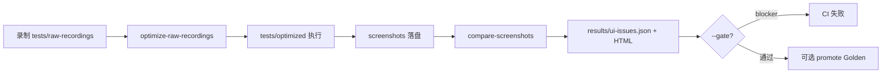

# UI 回归工作流

Visual Review Lite（UI State、Diff Region、人审 Approve）见 [visual-review-lite.md](./visual-review-lite.md)。

**Style-Drift 样式守护**（YAML Intent + computed style 指纹、Gate style-only）见 [style-drift-workflow.md](./style-drift-workflow.md)。

Studio **YAML 用例 / 口语试跑** Tab 与工作流见 [studio-yaml-and-nl-workflow.md](./studio-yaml-and-nl-workflow.md)。

**页面变化检测**设计（PageWatch 逆向分析、分区语义哈希、元素指纹）见 [page-change-detection-design.md](./page-change-detection-design.md)。

## 主路径（推荐）

## 目录约定

| 路径 | 说明 |
|------|------|
| `tests/raw-recordings/` | **主录制目录**（Codegen / Studio 写入） |
| `tests/optimized/` | 优化后可执行用例（`npm run test:optimized`） |
| `tests/ai-generated/` | **Legacy**，仅兼容旧脚本；新用例请用 raw-recordings |
| `screenshots/<迭代>/<脚本>/run-*-optimized/<timestamp>/` | 每次运行步骤 PNG |
| `screenshots-baseline/<迭代>/<脚本>/run-*-optimized/` | Golden 基线（无 timestamp） |
| `results/ui-issues.json` | 结构化 UI 问题清单 |
| `results/ui-regression/` | manifest、last-green 元数据 |
| `config/ui-regression.json` | 阈值、mask、基线策略 |

## 常用命令

| 命令 | 作用 |
|------|------|
| `npm run auto-test` | 录制 → pipeline → 执行 → 对比 |
| `npm run test:pipeline` | 预处理 + 优化（同 Studio「生成用例」） |
| `npm run test:regression -- --id=...` | 配置化 Job 回归 |
| `npm run auto-test -- --spec tests/raw-recordings/.../x.spec.ts` | 指定 raw（含 `original/`） |
| `npm run auto-test -- --from-original` | 扫描含 original 备份 |
| `npm run auto-test -- --batch --workers=2` | 批量并行执行 |
| `npm run auto-test -- --analyze-gate --gate` | 脚本质检 + UI 门禁 |
| `npm run compare-screenshots` | 生成 HTML + `ui-issues.json` |
| `npm run compare-screenshots -- --gate` | 存在 blocker 时 exit 1 |
| `npm run promote-baseline -- --script 260612/xxx --latest` | 提升最新 run 为 Golden |
| `npm run promote-baseline -- --script 260612/xxx --revert` | 撤销 Golden |
| `npm run screenshot-report` | 对比并打开报告（含滑块/闪烁/热力图/趋势） |
| `npm run studio` | Studio：问题列表、Promote Golden |

## 分析摘要（方案 A）

`compare-screenshots` 会额外生成：

| 产出 | 说明 |
|------|------|
| `results/ui-issues.json` → `plainLanguageAnalysis` | 结构化中文摘要 |
| `results/ui-issues-analysis.md` | 同上，Markdown |
| HTML **「分析摘要」** Tab | 按脚本合并重复行后的精简表格 |

合并规则：同一脚本 + 步骤号 + 步骤名（去掉 before/after 后缀）合并为一行，展示最大差异、原始条数、浏览器与对比类型。

## Hybrid 基线策略

对比时按优先级选择基线（`PLAYWRIGHT_COMPARE_BASELINE` 可强制）：

1. **golden** — `screenshots-baseline/` 中对应 step PNG  
2. **last-green** — `results/ui-regression/last-green-run.json` 记录的通过 run  
3. **oldest** — 同浏览器最早一次 run（兼容旧数据，标记为 `run-drift`）

## 严重度

由 `config/ui-regression.json` 配置：

- `blockerRatio`（默认 0.5%）
- `warningRatio`（默认 0.1%）
- 跨浏览器单独阈值：`crossBrowser.blockerRatio`
- `gate.mode: style-only` 时 gate 仅看 `style-drift` blocker 与 required structure missing；像素 diff 不进 gate

## 样式守护（styleChecks）

- 配置：`config/ui-regression.json` → `styleChecks.items`（按 `script` 匹配）；YAML Intent 可 `registerRuntimeStyleChecks`
- 作用域：items 可选 `snapshotName` / `state`，仅在该逻辑快照上采集与对比（见 [style-drift-workflow.md](./style-drift-workflow.md)）
- 容差：`fontSizePx`、`colorDelta`（RGB 距离，默认 3）

## AI 视觉 triage（降噪，非唯一门禁）

- 配置：`config/ui-regression.json` → `aiReview`（默认 `enabled: false`，`failOnUiBug: false`）
- 规则复审优先；Vision 覆盖时要求足够置信度，且**不会轻易把高置信 `ui_bug` 降成噪声**
- 硬门禁仍看像素比例 / `style-drift` / structure；AI 结论默认不单独让 CI 红

边界约定见 [ai-test-boundaries.md](./ai-test-boundaries.md)。

## CI

`.github/workflows/playwright.yml`：登录 → 执行 optimized + webkit → `compare-screenshots --gate` → 上传 artifact。
