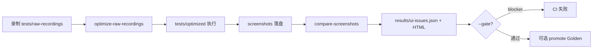

# UI 回归工作流

## 主路径（推荐）

## 目录约定

| 路径 | 说明 |
|------|------|
| `tests/raw-recordings/` | **主录制目录**（Codegen / Studio 写入） |
| `tests/optimized/` | 优化后可执行用例（`npm run test:optimized`） |
| `tests/ai-generated/` | **Legacy**，仅兼容旧脚本；新用例请用 raw-recordings |
| `screenshots/<迭代>/<脚本>/run-*-optimized/<timestamp>/` | 每次运行步骤 PNG |
| `screenshots-baseline/<迭代>/<脚本>/run-*-optimized/` | Golden 基线（无 timestamp） |
| `results/ui-issues.json` | 结构化 UI 问题清单 |
| `results/ui-regression/` | manifest、last-green 元数据 |
| `config/ui-regression.json` | 阈值、mask、基线策略 |

## 常用命令

| 命令 | 作用 |
|------|------|
| `npm run auto-test` | 录制 → pipeline → 执行 → 对比 |
| `npm run test:pipeline` | 预处理 + 优化（同 Studio「生成用例」） |
| `npm run test:regression -- --id=...` | 配置化 Job 回归 |
| `npm run auto-test -- --spec tests/raw-recordings/.../x.spec.ts` | 指定 raw（含 `original/`） |
| `npm run auto-test -- --from-original` | 扫描含 original 备份 |
| `npm run auto-test -- --batch --workers=2` | 批量并行执行 |
| `npm run auto-test -- --analyze-gate --gate` | 脚本质检 + UI 门禁 |
| `npm run compare-screenshots` | 生成 HTML + `ui-issues.json` |
| `npm run compare-screenshots -- --gate` | 存在 blocker 时 exit 1 |
| `npm run promote-baseline -- --script 260612/xxx --latest` | 提升最新 run 为 Golden |
| `npm run promote-baseline -- --script 260612/xxx --revert` | 撤销 Golden |
| `npm run screenshot-report` | 对比并打开报告（含滑块/闪烁/热力图/趋势） |
| `npm run studio` | Studio：问题列表、Promote Golden |

## 分析摘要（方案 A）

`compare-screenshots` 会额外生成：

| 产出 | 说明 |
|------|------|
| `results/ui-issues.json` → `plainLanguageAnalysis` | 结构化中文摘要 |
| `results/ui-issues-analysis.md` | 同上，Markdown |
| HTML **「分析摘要」** Tab | 按脚本合并重复行后的精简表格 |

合并规则：同一脚本 + 步骤号 + 步骤名（去掉 before/after 后缀）合并为一行，展示最大差异、原始条数、浏览器与对比类型。

## Hybrid 基线策略

对比时按优先级选择基线（`PLAYWRIGHT_COMPARE_BASELINE` 可强制）：

1. **golden** — `screenshots-baseline/` 中对应 step PNG  
2. **last-green** — `results/ui-regression/last-green-run.json` 记录的通过 run  
3. **oldest** — 同浏览器最早一次 run（兼容旧数据，标记为 `run-drift`）

## 严重度

由 `config/ui-regression.json` 配置：

- `blockerRatio`（默认 0.5%）
- `warningRatio`（默认 0.1%）
- 跨浏览器单独阈值：`crossBrowser.blockerRatio`

## CI

`.github/workflows/playwright.yml`：登录 → 执行 optimized + webkit → `compare-screenshots --gate` → 上传 artifact。
